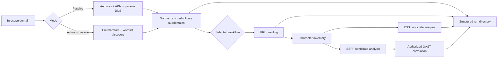

<div align="center">
  

  <h3>Built by <a href="https://github.com/Gix13">Gio Abou Sleiman</a> for authorized penetration tests</h3>

  <p><strong>One controlled pipeline for discovery, crawling, and evidence-oriented vulnerability triage.</strong></p>

  [](https://github.com/Gix13/super-subdomain-enumerator/actions/workflows/ci.yml)
  
  
  
  [](LICENSE)
</div>

## Why this project exists

Attack-surface discovery is rarely one command. Results arrive from passive sources, active enumerators, archives, crawlers, parameter miners, and specialist analyzers, each with different formats and failure modes. SuperSubdomainEnumerator coordinates those tools into a repeatable workflow with normalized inventories, per-stage evidence, and a clear separation between passive collection and active testing.

It is designed for penetration testers and security teams operating from a written scope. The value is orchestration: the project does not replace the underlying tools or the analyst who validates their output.

> [!CAUTION]
> Active modes generate traffic and may trigger payloads. Use them only on assets you own, controlled labs, or targets covered by explicit written authorization. Passive providers also have terms and rate limits that must be respected.

## Pipeline at a glance



## Choose the depth of the run

| Method | Enumeration | Crawling | XSS analysis | SSRF/OAST analysis |
| ---: | :---: | :---: | :---: | :---: |
| `0` | ✓ | No | No | No |
| `1` | ✓ | ✓ | No | No |
| `2` | ✓ | ✓ | ✓ | No |
| `3` | ✓ | ✓ | No | ✓ |
| `4` | ✓ | ✓ | ✓ | ✓ |

Passive mode limits the pipeline to non-intrusive sources and archival collection. Active mode adds tools that contact the target. The script prompts for the mode before execution.

## Capabilities

- Passive and active subdomain enumeration with normalized, deduplicated output
- URL gathering from live crawlers, public archives, and parameter-discovery tools
- Modular integrations: unavailable optional tools are reported and skipped
- Passive XSS candidate filtering plus opt-in active validation tools
- SSRF parameter heuristics, controlled URL mutation, and optional OAST correlation
- Per-run directories that preserve raw tool output and cleaned inventories
- API-key files kept local and excluded from Git

### Integration families

| Stage | Examples supported by the orchestrator |
| --- | --- |
| Discovery | crt.sh, Amass, ffuf, urlscan.io, Shodan, Censys, DNSDumpster |
| Historical URLs | gau, Wayback CDX, ParamSpider |
| Crawling | Gospider, Crawlee, Crawlergo, Katana, Hakrawler, Photon, LinkFinder, Arjun, Burp Suite, OWASP ZAP |
| XSS triage | gf, kxss, Gxss, Dalfox, Nuclei, XSStrike, XSSer |
| SSRF triage | gf, unfurl, qsreplace, httpx, Nuclei, SSRFmap, Interactsh |

Most integrations are external executables and are not installed automatically. Install only what your authorized workflow needs.

## Repository layout

```text
.
├── SuperSubdomainEnumerator.py   # Main orchestration pipeline
├── crawlee/
│   ├── crawler.js                # Optional JavaScript crawler
│   └── package.json
├── tests/                        # Offline helper tests
├── setup.sh                      # Python + optional Crawlee dependencies
├── shodan_keys.example.txt
├── censys_keys.example.txt
└── requirements.txt
```

## Quick start

Requirements: Python 3.9+ and the external tools required by your chosen stages.

```bash
git clone https://github.com/Gix13/super-subdomain-enumerator.git
cd super-subdomain-enumerator
python3 -m venv .venv
source .venv/bin/activate
./setup.sh
```

If Crawlee is not needed, install only the Python dependency:

```bash
python -m pip install -r requirements.txt
```

Inspect the CLI, then start with the narrowest appropriate workflow:

```bash
python SuperSubdomainEnumerator.py --help
python SuperSubdomainEnumerator.py --domain example.com
```

`example.com` above is illustrative; use an actual domain only when it is inside your approved scope.

### Override the active-enumeration wordlist

```bash
python SuperSubdomainEnumerator.py \
  --domain example.com \
  --wordlist /path/to/authorized-subdomains.txt
```

## Optional credentials and integrations

Shodan and Censys stages are skipped when their local key files are absent.

```bash
cp shodan_keys.example.txt shodan_keys.txt
cp censys_keys.example.txt censys_keys.txt
chmod 600 shodan_keys.txt censys_keys.txt
```

- `shodan_keys.txt`: one authorized API key per line
- `censys_keys.txt`: one `API_ID:API_SECRET` pair per line

Optional environment variables include:

| Variable | Purpose |
| --- | --- |
| `OAST_URL` | Analyst-controlled collaborator endpoint for active SSRF correlation |
| `INTERACTSH_LOG` | Existing Interactsh JSONL evidence path |
| `BURP_JAR_PATH` | Burp Suite JAR used by the crawler integration |
| `CHROMIUM_PATH` | Browser executable for Crawlergo |
| `SSRFMAP_PATH` | Local SSRFmap installation |
| `SSRFMAP_MODULES` | Comma-separated SSRFmap modules |

Never use credential rotation to evade quotas, provider limits, or access controls.

## Output and evidence handling

A run creates `<domain>_<timestamp>/` and may contain raw tool logs, cleaned subdomains, combined URLs, HTTP metadata, payload candidates, and OAST correlations. The exact tree depends on the selected method and locally available tools.

Before sharing an artifact:

1. Confirm the recipient is authorized.
2. Remove cookies, tokens, credentials, and personal information.
3. Redact client and infrastructure identifiers where required.
4. Separate automated candidates from manually validated findings.
5. Preserve enough provenance to explain which tool produced each signal.

## Practical use cases

- Build a consolidated subdomain inventory at the start of an authorized assessment
- Compare passive intelligence with in-scope active discovery
- Feed deduplicated hosts into controlled crawling and parameter analysis
- Correlate suspected blind SSRF behavior with an analyst-controlled OAST service
- Preserve repeatable evidence across a multi-tool reconnaissance workflow

## Limitations

- This is an orchestrator, not a self-contained scanner; tool coverage depends on local installations.
- Third-party CLIs and web APIs change, so individual integrations can require maintenance.
- Automated XSS and SSRF candidates are not proof of vulnerability.
- Full runs can be resource-intensive and noisy; select the smallest workflow that meets the objective.
- OAST callbacks establish interaction, but impact and root cause still require manual analysis.
- The script does not manage engagement scope or authorization for the operator.

## Verification status

CI performs offline Python/JavaScript syntax checks and unit tests for normalization and SSRF-candidate helpers. It does not install external security tools, contact providers, start a VPN, launch OAST infrastructure, or scan any target.

## Provenance

SuperSubdomainEnumerator was created by Gio Abou Sleiman for authorized penetration-testing engagements. This public edition is a sanitized portfolio copy with credentials, cookies, client targets, captures, and real assessment output removed.

For repository-security reports, see [SECURITY.md](SECURITY.md). For contribution expectations, see [CONTRIBUTING.md](CONTRIBUTING.md).
